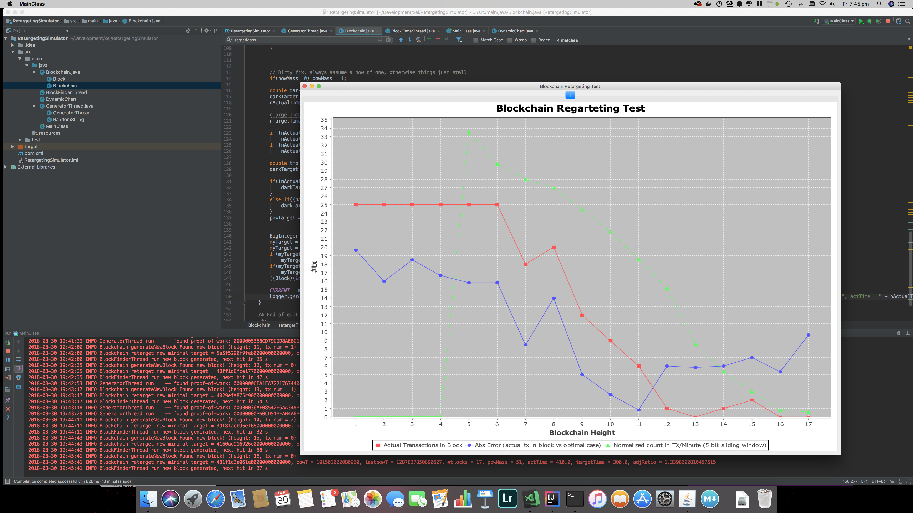

# Easter Hackaton: Blockchain Retargeting Algorithm

## Prize

Please for this repository and submit a link to your solution (along with the exact commit hash so we know what version to use) by Sun, 1st April 2018 11pm GMT time in the issues section. The solutions will be evaluated as stated below. The best submission will be awarded $500 worth of Bitcoin.

## The Problem Statement

Imagine you have a Blockchain which is already building blocks perfectly fine. Due to the nature of randomness, you never know a priori how much time will lie between two consecutive blocks, but assume that most of the time it takes between 30s and 60s for the Blockchain to extend by one block.

Now we have an application that submits transactions which then get included into these blocks. The tricky part, however, is that we do not want to allow more than 25 transactions to be included in each block. To cap this number, assume that the unconfirmed transaction cache will not allow to hold more than 25 elements at once.

But we do not only want to cap the number of transactions. In fact, we want a retarget mechanism that requires a certain amount of proof-of-work to be added to the transaction in order to target a transaction rate of around 10 tx / minute. Think of the 25 element cap as a safety measure in case there are peaks in computational power in the network and the retargeting algorithm is not fast enough to adapt.

In the simulator which is discussed below, one sample implementation has been made which is certainly failing. The challenge is about finding a retarget algorithm that holds the transaction rate around 10 tx/min as stable as possible.

## Summarized Statement

- We have a blockchain, that is growing at a rate of 30-60s per block
- We can include transactions in the blockchain
- We can never include (or broadcast) more than 25 transactions at once
- Transactions have a proof-of-work attached
- There is a retargeting mechanism constantly tuning the target value
- If the transaction has a "proof of work" below the target value, it may be included in the block if the cap of 25 is not yet hit
- We target 10 tx / minute

## The Simulator (Code)

This repository holds a simulator. Please feel free to pull it and build/run it using maven or just open it up in IntelliJ IDEA. Sometimes, the graph window starts minimized; just watch out in your taskbar.

```
mvn compile
mvn exec:java
```

The simulator basically reflects the scenario described above.

#### **Blockchain.java**
This file holds the Blockchain structure. it has all the features that add new Transactions to the current block and functions that create a new Block. Method *generateNewBlock()* is called from a different Thread and is responsible for growing the Blockchain. You have probably noticed, that it calls the *retarget()* method, which is setting the current target value to a Biginteger (`CURRENT = myTarget;`). The magic lies in the **retarget()** method. The Blockchain is stored in the *log* ArrayList, and it is ordered as well as unidirectionally linked by the *prevBlock* field in the Block structure. You are allowed to use that information only.

The Block structure is very simple:

```
class Block
{
    public int number;
    public int duration;
    public long target;
    Block prevBlock = null;

    public Block() {
        target = Long.MAX_VALUE / 100;
    }

}
```
| Field     | Explanation                                                                                                                                                                             |
|-----------|-----------------------------------------------------------------------------------------------------------------------------------------------------------------------------------------|
| number    | The number of transactions inside that block                                                                                                                                            |
| duration  | The time it took to mine that block / the time difference to the previous block                                                                                                         |
| target    | A target value that may range from 0 to LONG_MAX/100 This target value can be used to calculate the actually used target value in the field CURRENT, which can be any 16byte Biginteger |
| prevBlock | The previous block      

#### **GeneratorThread.java**

This file is responsible to mine new transactions that meet a certain target value specified in the Biginteger field *CURRENT*. You will not need to even look into that file.

#### **BlockfinderThread.java**

Randomly generates blocks, each 30-60 seconds apart, by repeatedly calling the generateBlock() function in Blockchain.java.

#### **DynamicChart.java**

This file contains the live plot, as shown below.

## The Simulator (Hands On)



You see the simulator in action here. The essential part is the plot. On the *x* axis you see the Blockchain height, on the *y* axis you see the number of transactions. There are basically three things plotted.

1. The actual transactions in one specific block. Since the time between blocks can be different, this value does not mean much because 1 transaction in a block of 30 seconds has to be differentiated from 1 transaction that is in a block of 60 seconds.

2. The absolute error, this is the absolute difference between the actual number of transactions in one block and the number of expected transactions. For example: We are targeting a frequency of 10 tx/minute; if we end up with a block 30 seconds with 5 transactions it it, the absolute error is 0, because at a rate of 10 tx/minute, one would expect a 30 second block to have just 5 tx in it. If you, however, have a block of 60s with 5 transactions in it, the absolute error would be 5.

3. The rate of transactions per minute measured by a sliding window of 5 blocks.

## The Goal

The goals can be explained easily at the chart:

- The red line should be always below 25 (the hard cap, remember?)
- The blue line should be as close to 0 as possible
- The green line should be as close as possible to 10 tx/minute

## Measurement Criteria

We will measure your algorithms performance in three different settings and a random seed that corresonds to the hash of the first Bitcoin block after the submission deadline as a upper case string value. The random number generator will be seeded once upon start. If you complain that you do not know the settings beforehand, then thanks for reading until here and gool luck with different challenges.

We will test this simulator as it is now as well as three different scenarios where a) the miner stops generating new TX for a few blocks in between b) The miners "processing power" decreases over time and c) four spikes in processing power where there will be a few huge changes in how fast the transaction maker comes up with new transactions. Most likely the computation speed will be limited by adding an additional sleep in the GeneratorThread's random number routine.

We will run your simulation in each of these settings for 100 blocks each. Over all four runs, we will sum up the absolute error in each block. The submission with the least cumulative error wins.

## Other Criteria

- Your solution must run in O(1) both regarding storage and algorithmic complexity, means it must be invariant to the Blockchain length or the number of transactions and not introduce and storage that depends on either Blockchain length or number of transactions. However, you may introduce a constant number of fields in you need to.
- You are only allowed to edit that area inbetween the two comments in Blockchain.java
- You must not change the way transactions or blocks are generated and you must not adjust the Block structure
- You may only use the information available in the log Array (**This part is important!!! Do not use any external information about the current time or anything**)

## Happy Hacking

Have fun and keep that blue line as close to zero as you can!
